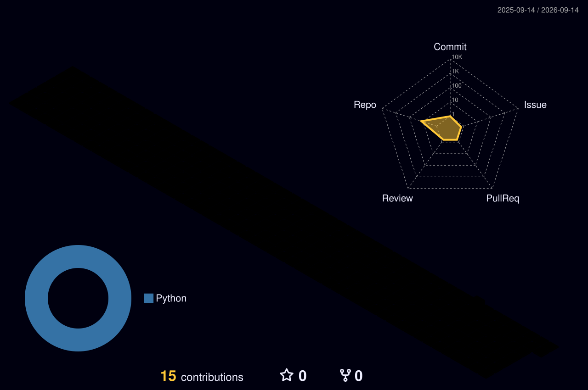

<div align="center">

<!-- ANIMATED HEADER -->


<!-- TYPING EFFECT -->
[](https://aijob.com.tw)

<br>

<!-- TOP BADGES -->

&nbsp;
[](https://aijob.com.tw)
&nbsp;
[](https://step1ne.com)

</div>

---

<!-- PORTFOLIO SHOWCASE -->
<div align="center">

## 💼 AIJOB — 客製化 AI 系統開發與實戰培訓

<a href="https://aijob.com.tw">

</a>

<br><br>

<table>
<tr>
<td align="center" width="33%">
<a href="https://aijob.com.tw/services">

<br><br>
<b>🤖 AI 系統開發</b>
<br>
<sub>AI 智能體、招募優化工具、<br>內容行銷自動化</sub>
</a>
</td>
<td align="center" width="33%">
<a href="https://aijob.com.tw/tools">

<br><br>
<b>🧩 開源技能包</b>
<br>
<sub>Threads自動發文、SEO健檢、<br>職缺文案、可靠排程</sub>
</a>
</td>
<td align="center" width="33%">
<a href="https://step1ne.com">

<br><br>
<b>🏢 STEP1NE 集團</b>
<br>
<sub>AIJOB 隸屬於<br>STEP1NE 集團旗下</sub>
</a>
</td>
</tr>
</table>

</div>

---

## `$ whois aijob`

```js
const aijob = {
    name: "AIJOB",
    type: "AI 協作專業團隊",
    parentCompany: "STEP1NE",
    website: "aijob.com.tw",
    location: "Taiwan 🇹🇼",
    mission: "把 AI 從一個聊天工具，變成企業真正能用的系統",
    focus: [
        "客製化 AI 系統開發（AI Agent / RAG / 自動化）",
        "企業 AI 協作導入與實戰培訓",
        "開源 AI 技能包（Claude Code Skills）",
    ],
};
```

<div align="center">

> *「每一步自動化，都是為了把時間還給真正重要的事 — 人與人的連結。」*

</div>

---

## 🧠 What We Do

<table>
<tr>
<td width="50%">

### 🎯 客製化 AI 系統開發
- AI 智能體（Agent）開發與導入
- RAG 企業知識庫建置
- 招募/流程自動化系統
- 客製化 AI 工作流串接

</td>
<td width="50%">

### 🤝 AI 協作導入 × 實戰培訓
- 企業 AI 協作導入諮詢與陪跑
- AI 內訓與實戰課程
- 開源 Claude Code 技能包（見下方 Featured Projects）
- 招募/人才領域的 AI 應用經驗

</td>
</tr>
</table>

<div align="center">

[](https://aijob.com.tw)

</div>

---

## 🎯 Skill Proficiency

<div align="center">



</div>

---

## 🛠️ Tech & Tools

<div align="center">

#### 🤖 AI & LLM


#### 🔄 Automation & No-Code
-6D00CC?style=for-the-badge&logo=make&logoColor=white)


#### 💻 AI-Assisted Development


</div>

---

## 🏆 GitHub Trophies

<div align="center">

[](https://github.com/AIJobpublic)

</div>

---

## 🐍 Contribution Snake

<div align="center">

<picture>
  <source media="(prefers-color-scheme: dark)" srcset="https://raw.githubusercontent.com/AIJobpublic/AIJobpublic/output/github-snake-dark.svg" />
  <source media="(prefers-color-scheme: light)" srcset="https://raw.githubusercontent.com/AIJobpublic/AIJobpublic/output/github-snake.svg" />
  
</picture>

</div>

---

## 📊 GitHub Stats

<div align="center">


</div>

<br>

<!-- ACTIVITY GRAPH -->
<div align="center">

[](https://github.com/AIJobpublic)

</div>

---

## 🏙️ 3D Contribution Graph

<div align="center">

<picture>
  <source media="(prefers-color-scheme: dark)" srcset="./profile-3d-contrib/profile-night-rainbow.svg" />
  <source media="(prefers-color-scheme: light)" srcset="./profile-3d-contrib/profile-south-season-animate.svg" />
  
</picture>

</div>

---

## 📈 Advanced Metrics

<div align="center">


</div>

---

## 🚀 Featured Projects

<div align="center">

<a href="https://github.com/AIJobpublic/threads-auto-publisher">

</a>
&nbsp;&nbsp;
<a href="https://github.com/AIJobpublic/aijob-seo-audit">

</a>

</div>

<br>

<details>
<summary><b>📂 更多專案（點擊展開）</b></summary>
<br>

| 專案 | 說明 | 技術 |
|------|------|------|
| 🧵 **[threads-auto-publisher](https://github.com/AIJobpublic/threads-auto-publisher)** | 走 Meta 官方 API 的 Threads 自動發文服務，回覆一定要人核准才送出 | `Cloudflare Workers` `Claude Code Skill` |
| ✍️ **[aijob-job-posting-writer](https://github.com/AIJobpublic/aijob-job-posting-writer)** | 獵頭判斷邏輯寫職缺文案，不是套版式行銷文案 | `Claude Code Skill` |
| ⏰ **[aijob-reliable-automation](https://github.com/AIJobpublic/aijob-reliable-automation)** | 排程任務上線後怎麼確保壞掉會被發現，不是安靜壞掉 | `Claude Code Skill` |
| 🔍 **[aijob-seo-audit](https://github.com/AIJobpublic/aijob-seo-audit)** | 開源白帽 SEO/AEO/GEO 網站健檢工具，在真實上線網站驗證過 | `Python` `Claude Code Skill` |
| 🎬 **[aerovisor-concept](https://github.com/AIJobpublic/aerovisor-concept)** | AI 生成場景＋運鏡的 scroll-scrub 產品概念網站 | `Vite` `JavaScript` |
| 🌐 **[aijob.com.tw](https://aijob.com.tw)** | 官方網站，用 Claude Code 從頭開發到上線 | `Next.js` `TypeScript` |

</details>

---

## 🗺️ Our Journey

```
2024 ─── STEP1NE 團隊開始把 AI 工具導入獵頭實戰工作
  │
  ├── 發現 No-Code 自動化的威力（Make / n8n）
  │
  ├── 第一個自動化工作流上線 → 節省 60% 重複工作時間
  │
2025 ─── 深入 AI-Assisted Development（Cursor / Claude Code）
  │
  ├── 開始用 AI 打造客製化系統，不只是流程自動化
  │
  ├── 成立 AIJOB，作為 STEP1NE 集團的 AI 系統開發與培訓品牌
  │
2026 ─── 持續進化中... 🚀
  │
  └── 目標：把開源工具與真實案例，變成 AIJOB 的技術權威資產
```

---

## 💡 Our Philosophy

<div align="center">

```
┌─────────────────────────────────────────────────────────┐
│                                                         │
│   "The best engineer is not the one who writes code,    │
│    but the one who solves problems."                    │
│                                                         │
│    最好的工程師不是會寫程式的人，                            │
│    而是能解決問題的人。                                     │
│                                                         │
│    — AIJOB（STEP1NE 集團旗下品牌）                          │
│                                                         │
└─────────────────────────────────────────────────────────┘
```

</div>

---

## 🌐 Connect with AIJOB

<div align="center">

[](https://aijob.com.tw)
[](https://step1ne.com)
[](https://www.linkedin.com/in/jacky-chen-41736a2b9/)
[](https://lin.ee/ZTgJbYG)

<br>

**🤝 想導入 AI、或想聊聊技術合作？歡迎聯繫！**

[](https://aijob.com.tw)

</div>

<div align="center">

---

<!-- FOOTER -->


<sub>⚡ Built with AI, Designed with Purpose</sub>
<br>
<sub>💡 *Non-engineer who builds like one — powered by AI*</sub>

</div>

<!-- profile -->
